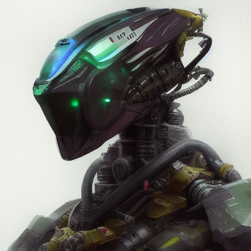

# Robo-Diffusion
 

A dreambooth-method finetune of stable diffusion that will output cool looking robots when prompted.

# Model

Weights can be found on huggingface: https://huggingface.co/nousr/robo-diffusion

# Usage

Keep the words `nousr robot` towards the beginning of your prompt to invoke the finetuned style.

---

*NOTE: usage of this model implies accpetance of stable diffusion's [CreativeML Open RAIL-M license](LICENSE)*
